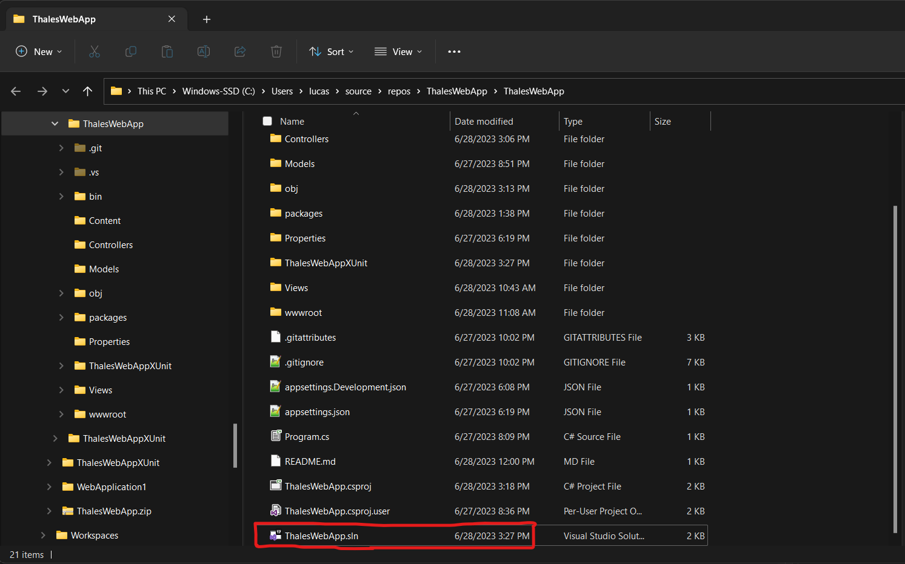
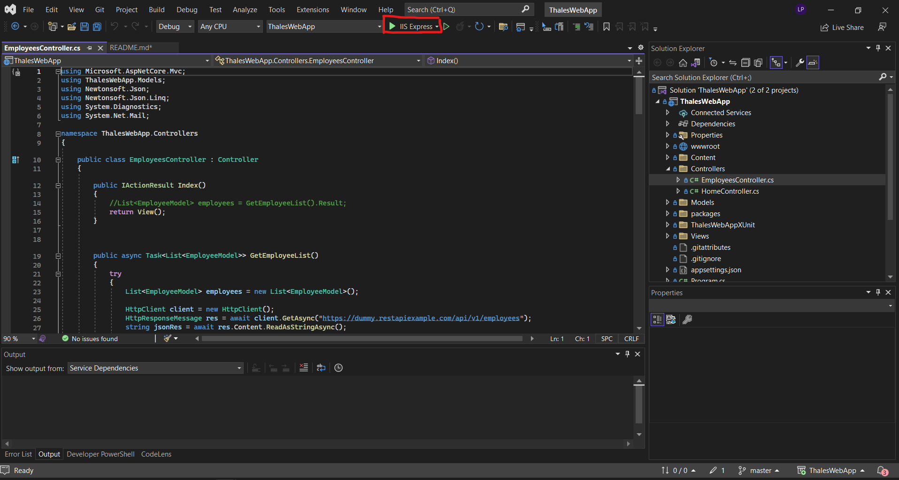

# ThalesWebApp

This .NET MVC application was build using .NET 7.0 and Visual Studio 2022.

This application consumes data from https://dummy.restapiexample.com/api/v1/

Some times this API returns a Too Many Request error, when this happens the app will redirect the user to a custom error view.

# How To Run
Make sure you have .Net 7.0 installed. [You can download it here.](https://dotnet.microsoft.com/en-us/download/dotnet/7.0)\
\
Open the ThalesWebApp.sln file on Visual Studio Code 2017 or newer.
\
\
Run using IIS Express.\
\
\

